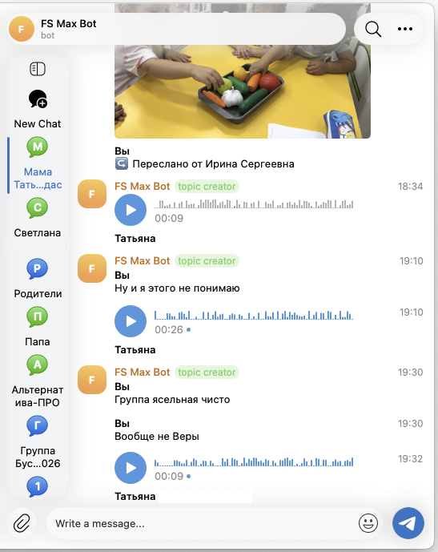
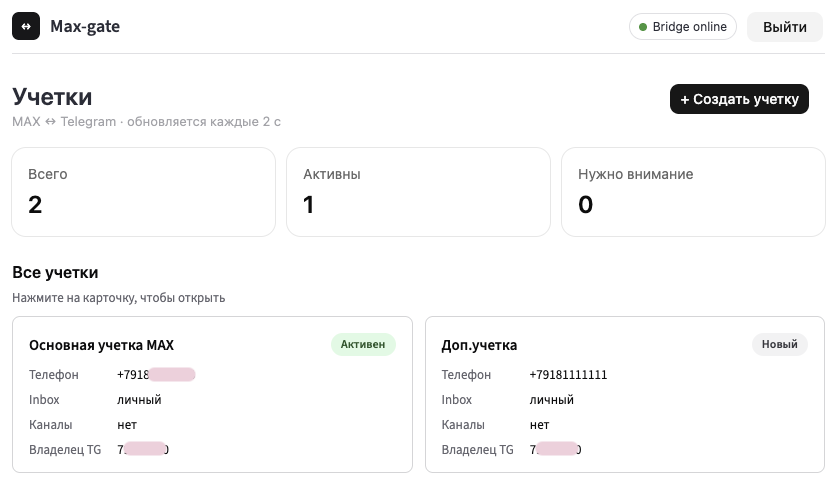
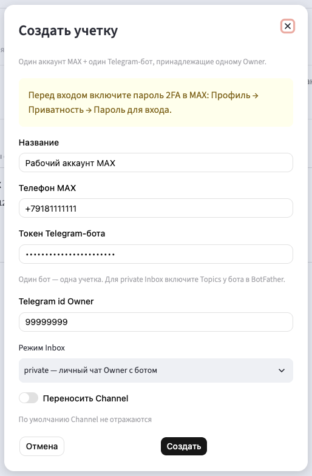
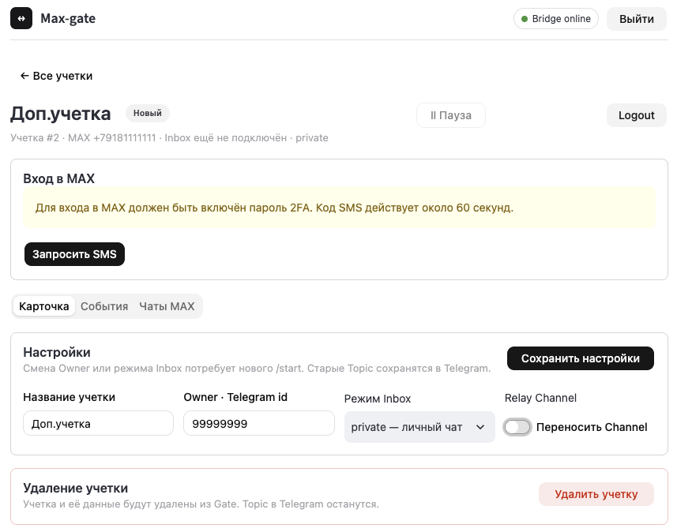
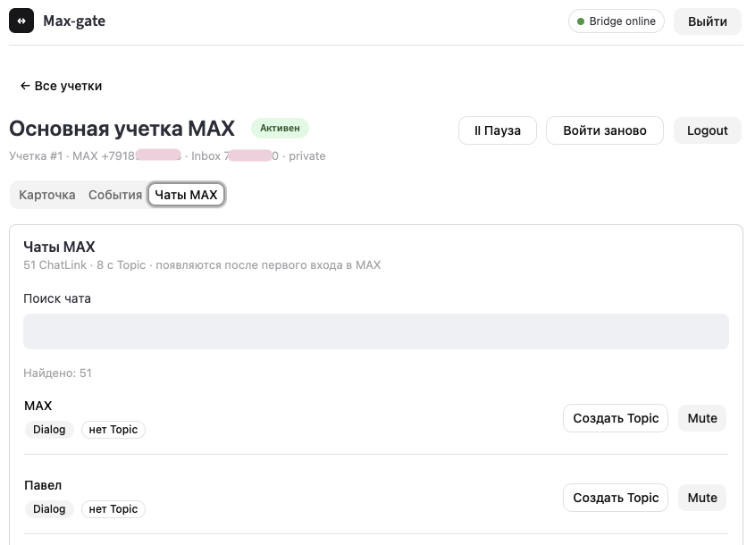
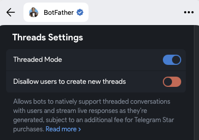

# Max-gate

Переносит переписку из мессенджера MAX в Telegram и обратно. Каждый чат MAX становится
отдельной темой (топиком) у вашего Telegram-бота, ответы в теме уходят в MAX. Один экземпляр обслуживает несколько учеток.

**В обе стороны поддерживаются**:
- Правки, удаления, ответы (reply)
- Форматирование: жирный, курсив, код, ссылки, цитаты
- Изображения, голосовые сообщения, видео

**Только из Телеграм в MAX**:
- реакции

## Screenshots











## Для чего и зачем

Многим не хочется запускать мессенджер MAX ни на телефоне, ни на десктопе. Какое-то время терпел работу в браузере, но нужна мобильность. Поэтому сделал небольшой сервис в Docker.
Мне попадались похожие решения, но они были для MAX-ботов, а нужна была полноценная эмуляция клиента. Клиент реализует библиотека [PyMax](https://github.com/MaxApiTeam/PyMax) - огромная благодарность автору!

## Запуск и требования

- Сервер с Docker Engine и Docker Compose.
- Аккаунт MAX с включённым паролем 2FA. Включите его в приложении MAX заранее:
  без пароля сервер MAX не пускает новое устройство, и вход с SMS-кодом не пройдёт.
- Telegram-бот от [@BotFather](https://t.me/BotFather) с включёнными Threaded Mode (Топики).



1. Скопируйте `.env.example` в `.env`, задайте `MAXGATE_UI_PASSWORD` (пароль входа
   в веб-интерфейс) и `MAXGATE_INTERNAL_TOKEN` (любая случайная строка).
2. Сгенерируйте ключ шифрования базы и запишите его в `.env` как `MAXGATE_SECRET_KEY`:

   ```bash
   docker compose -f docker-compose.yml run --rm --no-deps bridge maxgate gen-key
   ```

3. Соберите и запустите:

   ```bash
   docker compose -f docker-compose.yml up --build -d
   ```

4. Откройте <http://127.0.0.1:8501>, войдите по паролю и нажмите «Создать учётку»:
   укажите имя, номер MAX, токен бота и ваш Telegram id.
5. Нажмите «Войти», введите SMS-код из MAX (около минуты на ввод), затем пароль 2FA.
   Пароль нигде не сохраняется: MAX запоминает устройство, и повторный вход его не требует.
6. Напишите боту `/start`. Чаты MAX появятся темами в переписке с ботом.

Веб-интерфейс доступен только с самого сервера. Для доступа снаружи поставьте перед ним
reverse proxy с HTTPS.

## Команды бота

| Команда | Что делает |
| --- | --- |
| `/status` | Состояние учётки |
| `/mute`, `/unmute` | Выключить и включить перенос для темы |
| `/history N` | Подгрузить последние N сообщений чата (до 100), пропуская уже перенесённые |
| `/reload N` | Заново прислать последние N сообщений, даже если они уже были в теме |
| `/delete` | Ответом на сообщение в теме: удалить оригинал в MAX для всех и копию в Telegram |
| `/info` | Сведения о чате |

## Для разработчиков

База лежит в томе `maxgate-data`. Для резервной копии остановите контейнеры и сохраните
файл `maxgate.db` вместе с `MAXGATE_SECRET_KEY`: без ключа база бесполезна.

Архитектура и решения: [docs/design.md](docs/design.md), [docs/adr/](docs/adr/),
глоссарий [CONTEXT.md](CONTEXT.md), рабочие заметки [CLAUDE.md](CLAUDE.md).

## Лицензия

[GNU AGPL-3.0](LICENSE), © 2026 Sergey Filkin. Пользоваться, изменять и распространять можно
свободно, в том числе в коммерческих целях. Если вы распространяете изменённую версию или даёте
пользоваться ею по сети, её исходный код нужно открыть под той же лицензией.
